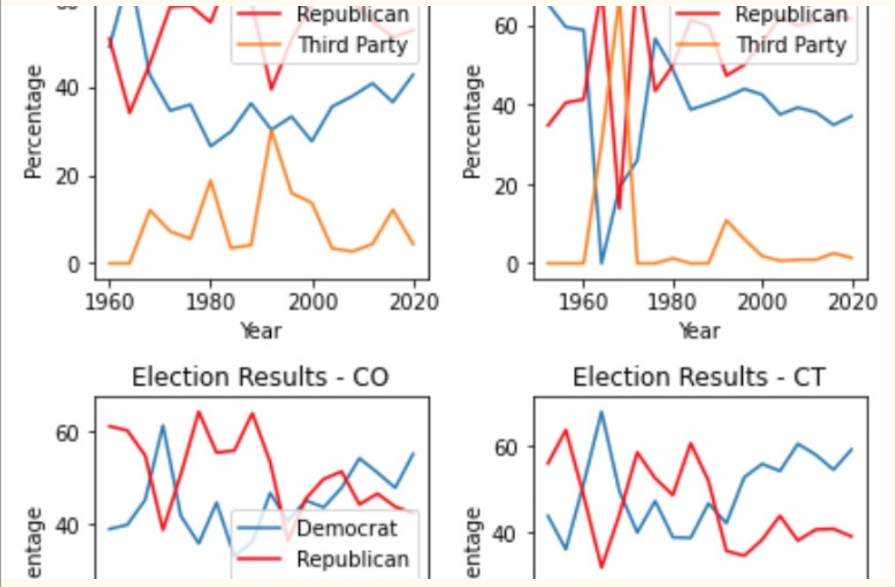
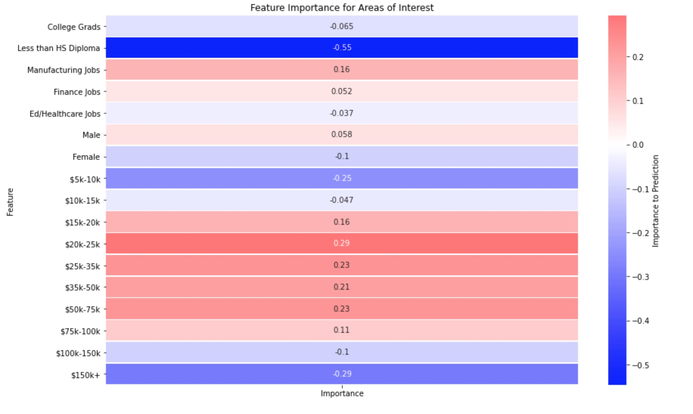

# U.S. Elections Analysis

## Overview

This project utilizes a presidential elections dataset, as well as the 2020 Census data, to analyze the factors that may indicate a more receptive voter base to Democrats.

## Business Problem

The purpose of this project is to present an electoral organization with a path to victory for the presidency and house majority. This project identifies the pivotal districts in the swing states, and through analysis and modeling, determines the strongest indicators of a lean towards democrats or republicans. 

## Data Understanding

This project uses two publicly available datasets. The first one lists the precentage of votes that went democrat, republican, or third party, for every presidential election dating back to 1952, broken down by congressional district [See Elections Data](https://www.kaggle.com/datasets/cviaxmiwnptr/potus-election-results-by-district-19522020?select=combined_1952-2020.csv). The other dataset is the U.S. 2020 Census of the population breakdown, split into three tables: 
* Education 
* Job Industry
* Financial Bracket

[See Census Data](https://www.kaggle.com/datasets/mittvin/u-s-census-dataset-education-finance-industry/data?select=Educationv.csv)

These tables are also divided by congressional district. The tables were merged, and then joined with the elections dataset on their congressional district and the year 2020.


## Methods

This project uses descriptive analysis, exploratory data analysis, data visualization, and unsupervised learning. This provides key insights to understanding the dynamics to the swing states in this country, broken down by congressional district, and how Democrats can craft a winning message.


## Conclusions

* 1. Focus on opportunities in education. There are a number of districts in Iowa and Indiana with a high number of residents that have had less educational opportunity, this should be an appealing message for Democrats to campaign on.
* 2. The higher the percentage of voters working in agriculture, the likelier a Republican victory. Focus on ways to create an economic/environmental message that can appeal to them.

* 3. The Democrats have performed better in the swing states in recent elections, but have lost Florida and Ohio. The recent dynamics don't bode well for Democrats in these states, and they should focus their resources on other swing states. There are a few seemingly gettable states, like Iowa.


## Next Steps

* 1. Find more data to improve the model's performance.
* 2. A deeper analysis of the Census data is necessary, as there can be underlying factors that explain these trends in a deceptive way. 
* 3. Gathering Census data from election years prior to 2020 will help further identify trends and factors to focus on.

## For More Information

See the full analysis in the [Jupyter Notebook](election_data.ipynb) or review this [presentation](presentation.pdf).

See the data used by clicking [here](./data/).

Author: Christopher Miley

September 24th, 2024

## Repository Structure

```
├── data
├── images
├── README.md
├── election_data.ipynb
└── presentation.pdf
```